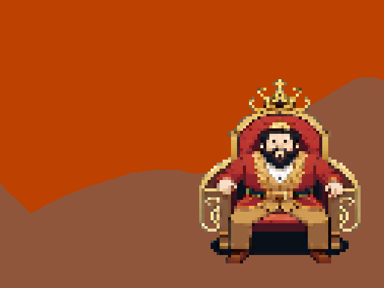
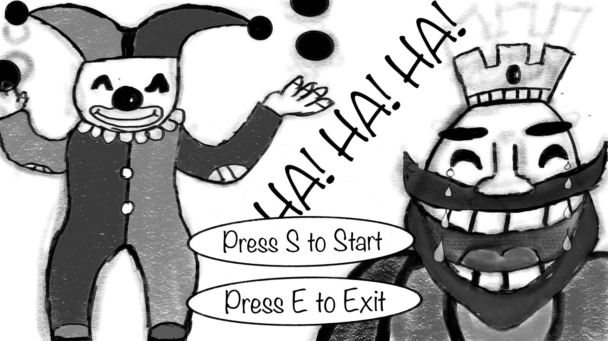

# GGJ2024.

This is our attempt to develop a game in 48 hours as part of this year's Global Game Jam. We were prompted to stick with the theme: "Make me Laugh". 

<div align="center">
  
</div>

## Jester's Jest

King Chuckles the First, known for his hearty laughter, has fallen into a deep melancholy after the passing of the previous buffoon. The court physicians believe that only a collection of unique and rare items with the power to amuse can save the king from a humorless demise. Your task is clear: venture through the diverse landscapes of Mirthland, face quirky challenges, and gather the whimsical artifacts needed to break the king's sorrow.

<div align="center">
  
</div>


## Build and Run
- Java 11 or above
```
cd ggj2024
cd scripts
./run.sh
```

## Developers

* [m4mbo](https://github.com/m4mbo)
* [ginesmoratalla](https://github.com/ginesmoratalla)
* [prosk-sudo](https://github.com/prosk-sudo)
* [kamepe](https://github.com/kamepe)
* [MuAzi04](https://github.com/MuAzi04)
* Junior Saar 

<div align="center">
  
  
  
  
</div>
